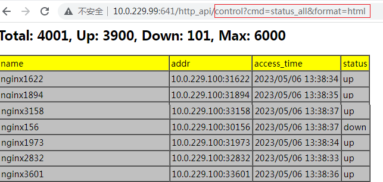
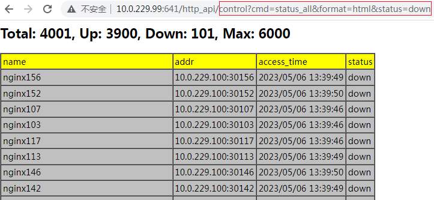
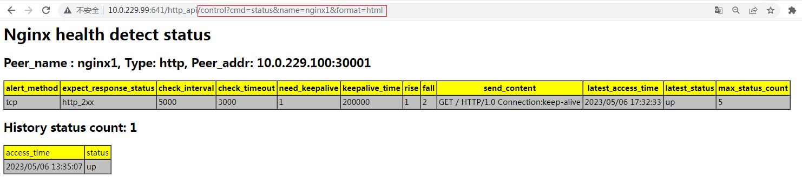

# ngx_health_detect_module

(中文版本请参考这里 [here](https://github.com/alexzzh/ngx_health_detect_module/blob/master/README.md))

> This module provides proactive health detect for back-end node, the back-end node can be Nginx upstream servers (support http upstream && stream upstream) which added when parsing upstream config or added by dynamic restful APIs
-----
- All down and up back-end node  

- All down status back-end node  

- One back-end node health status, historical status, and detect policy  


Table of Contents
=================
* [Development background](#development-background)
* [Description](#description)
* [How to install](#how-to-install)
* [Basic usage](#basic-usage)
* [Detect policy description](#detect-policy-description)
* [Restful api](#restful-api)
* [Added nginx directive](#added-nginx-directive)
* [Test report](#test-report)
* [Todo](#todo)
* [Status](#status)
* [Bugs and patches](#bugs-and-patches)
* [See also](#see-also)
* [Copyright and License](#copyright-and-license)

Development background
======================
- We found many bugs when use [ngx_healthcheck_module](https://github.com/zhouchangxun/ngx_healthcheck_module) in our project, especially when dynamically adding or deleting upstream nodes with the dynamic domain name resolution module, eg: local and shared memory node array indexes that are confusing, the node state judgment conditions are not strict when reusing local and shared memory node space, and the lock control is unreasonable when accessing shared memory nodes concurrently, too much code redundancy, etc
- Considering that the proactive health check function is relatively simple, that is, adding and deleting nodes and querying node status, it is actually more suitable to use the rbtree as the node storage structure, especially when there are many detection nodes, it is more efficient, the code is also easier to understand and maintain. In addition, ngx_healthcheck_module module was last submitted in June 2021 and has not been continuously maintained, so not intended to patch to this module, instead, develop a new module, which is equivalent to the ngx_healthcheck_module module plus dynamic addition and deletion probe node function by restful API (switch control, can be turned off)

Description
===========

Provides proactive health detect for back-end node
- Main features
  - the back-end node can be Nginx upstream servers (support http upstream && stream upstream) which added when parsing upstream config or added by dynamic restful APIs
  - Supports health detection of Layer 4 and Layer 7 backend nodes
    - Four-layer supported detection type: TCP 
    - Seven-layer supported detection type: http / https
  - Support 'dynamically' adding/removing backend nodes, modifying backend node detection policies, and checking backend node status through Restful APIs
  - Support customized detect policies for backend nodes
    - Detect type
    - Detect interval and Detect timeout
    - Send content
    - Detection failure alarm mode
    - Expected response value
    - Long/Short connection and how long connection live
  - Support checking the current status of all backend nodes at the same time, output format: html / json
  - Support checking the detection policy and historical status of a one backend node, output format: html / json
  
How to install
==============

```
git clone https://github.com/nginx/nginx.git
git clone http://git.koal.com/zhangzhenghao/ngx_health_detect_module
cd nginx/;
git checkout branches/stable-xxx
git apply ../ngx_health_detect_module/patch/nginx_healthdetect_for_nginx_xxx+.patch

./auto/configure --add-module=../ngx_health_detect_module/
make && make install
```

[Back to TOC](#table-of-contents)

Basic usage
===========

**nginx.conf** 
```nginx
user  root;
worker_processes  4;
error_log  logs/error.log  info;
#pid        logs/nginx.pid;

events {
    worker_connections  32768;
}

http {
    health_detect_shm_size 10m; #Specifies the size of shared memory to hold back-end node detect policies and health status
    health_detect_max_history_status_count 5; #Specify the number of times the historical status of a one backend node is recorded

    server {
        listen       641;
        server_name  localhost;
    
       location /http_api { 
           root   html;
           index  index.html index.htm;
           health_detect_dynamic_api check_only=false; #Provides restful API for http module
       }

       location /tcp_api {  
           root   html;
           index  index.html index.htm;
           stream_health_detect_dynamic_api check_only=false; #Provides restful API for stream module
       }
      	
       location /build-in {
          proxy_pass http://httpbackend;
       }
     }
        
     upstream httpbackend {
          server 1.1.1.1:11111  max_fails=0 fail_timeout=20s;
          # Enable this module and specify detect policy 
          health_detect_check type=http alert_method=syslog rise=2 fall=3 interval=1000 timeout=5000 keepalive=true keepalive_time=500000; 
          # Specify expect response code when detect type is http
          health_detect_http_expect_alive http_2xx http_3xx;
          # specify the content of the http request when detect type is http, if you want to enable 'keep-alive', must set keepalive=true in health_detect_check directive
          health_detect_http_send "GET / HTTP/1.0\r\nConnection: keep-alive\r\n\r\n";
     }
}

stream {
       health_detect_shm_size 10m; #Specifies the size of shared memory to hold back-end node detect policies and health status
       health_detect_max_history_status_count 10; #Specify the number of times the historical status of a one backend node is recorded
	
       server {
            listen       642 ;
            proxy_pass  tcpbackend;
         }
      
      upstream tcpbackend {
          server 2.2.2.2:22222  max_fails=0 fail_timeout=20s;
          # Enable this module and specify detect policy 
          health_detect_check type=tcp alert_method=syslog rise=2 fall=3 interval=1000 timeout=5000 keepalive=true keepalive_time=500000; 
      }
} 
```

Detect policy description
=========================
- no matter back-end node added by upstream config or restful api , the policy is same  

`Syntax` 
> {"peer_type":"tcp|http","peer_addr":"ip:port","send_content":"xxx","alert_method":"log|syslog","expect_response_status":"http_2xx|http_3xx|http_4xx|http_5xx","check_interval":1000,"check_timeout":milliseconds , "need_keepalive": 1|0, "keepalive_time": milliseconds , "rise":count, "fall":count}  
  
> Only `peer_type` and `peer_addr` fields are `must` required, other fields use default value if not specified

`Default`: 
- tcp
``` python
 {"send_content":"","alert_method":"log","expect_response_status":"","check_interval":30000,"check_timeout":3000 , "need_keepalive": 0, "keepalive_time": 3600000 , "rise":1, "fall":2}  
```
- http
``` python
{"send_content":"GET / HTTP/1.0\r\nConnection:close\r\n\r\n","alert_method":"log","expect_response_status":"http_2xx"，"check_interval":30000,"check_timeout":3000 , "need_keepalive": 0, "keepalive_time": 3600000 , "rise":1, "fall":2}
```

`Detail`
- peer_type: detect type
  - tcp：simple tcp connection, if the connection is successful, it shows the back-end normal.
  - http：send an HTTP request, by the state of the back-end reply packet to determine whether the back-end survival.
- peer_addr: detect node address
- send_content：send content to backend nodes when detecing.
  - tcp: ignore
  - http：specify the content of the http request, if you want to enable 'http keepalive', specify the sending content as "GET / HTTP/1.0\r\nConnection:keep-alive\r\n\r\n".
- alert_method： alert method when detection fails
  - log: just log the detect failure.
  - syslog: forwards error logs to syslog.
- expect_response_status： the expected response value
  - tcp: ignore
  - http: specifies which responses are received to be considered healthy for the backend node.
- check_interval：the interval of health check packets sent to the backend
- check_timeout: timeout for backend health requests
- need_keepalive： specifies whether long connections are enabled, if long connections are used, multiple detection will multiplex the same connection, otherwise each detect requires a new connection
  - long connections have better performance than short connections, but they need to deal with connection keepalive and continuous consumption of server-side connection resources, and short connections are 'recommended' regardless of performance.  
  - if the detect type is HTTP and 'send_content' specifies the use of 'HTTP keepalive', long connection needs to be set.
  - long connections are 'not recommended' when the detect type is tcp and the connection to the backend node needs to go through a firewall, NAT device. Because after the TCP long connection is established, the detection mechanism uses the peek function, at this time, even if the firewall drop the request packet, peek function still succeed until the 'keepalive_time' is exceeded, during which the detect status may be incorrect, and setting a shorter "keepalive_time" can reduce the impact of this problem
- keepalive_time：specifies the long connection time-to-live
- fall(fall_count): the server is considered down if the number of consecutive failures reaches fall_count.
- rise(rise_count): the server is considered up if the number of consecutive successes reaches rise_count.

[Back to TOC](#table-of-contents)

Restful api
===========
```
ip:port/http_api/control?cmd=add&name=node_name
ip:port/http_api/control?cmd=delete&name=node_name
ip:port/http_api/control?cmd=delete_all
ip:port/http_api/control?cmd=status&name=node_name[&format=json|html]
ip:port/http_api/control?cmd=status_all[&status=down|up][&format=json|html]
```
- Add detect node
``` python
curl -X POST -H 'Content-Type: application/json' -d '{"peer_type":"http","peer_addr":"10.0.229.100:34001","send_content":"GET / HTTP/1.0\r\nConnection:keep-alive\r\n\r\n","alert_method":"log","expect_response":"http_2xx","check_interval":5000,"check_timeout":3000, "need_keepalive": 1, "keepalive_time": 200000, "rise":1, "fall":2}' '10.0.229.99:641/http_api/control?cmd=add\&name=nginx4001'

add or update node success
```
- Delete one detect node
``` python
curl -X DELETE '10.0.229.99:641/http_api/control?cmd=delete\&name=nginx4001'

delete node success
```
- Delete all detect node 
``` python
curl -X DELETE '10.0.229.99:641/http_api/control?cmd=delete_all'

delete all node success
```
- Check current status of all detect nodes，format: json
```python
curl http://10.0.229.99:641/http_api/control?cmd=status_all 
{
"total": 151,
 "up": 150,
 "down": 1,
 "max": 6000,
"items": [
    {"name": "nginx81","addr": "10.0.229.100:30081","access_time": 2023/05/06 16:50:04, "status": "up"}, 
    {"name": "nginx66","addr": "10.0.229.100:30066","access_time": 2023/05/06 16:50:04, "status": "up"}, 
    {"name": "nginx85","addr": "10.0.229.100:30085","access_time": 2023/05/06 16:50:04, "status": "up"}, 
    {"name": "nginx62","addr": "10.0.229.100:30062","access_time": 2023/05/06 16:50:04, "status": "up"}, 
    {"name": "nginx37","addr": "10.0.229.100:30037","access_time": 2023/05/06 16:50:04, "status": "up"}, 
    {"name": "nginx107","addr": "10.0.229.100:30107","access_time": 2023/05/06 16:50:01, "status": "down"}, 
    {"name": "nginx103","addr": "10.0.229.100:30103","access_time": 2023/05/06 16:50:01, "status": "down"}, 
```
- Check current status of all detect nodes，format: html
```python
curl http://10.0.229.99:641/http_api/control?cmd=status_all&format=html
```

 
- Check one detect node policy and history status, format: json 

```python
curl http://10.0.229.99:641/http_api/control?cmd=status\&name=nginx100
{"peer_name": "nginx100",
  "type": "http",
  "peer_addr": "10.0.229.100:30100",
  "alert_method": "tcp",
  "expect_response_status": "http_2xx ",
  "check_interval": "5000",
  "check_timeout": "3000",
  "need_keepalive": "1",
  "keepalive_time": "200000",
  "rise": "1",
  "fall": "2",
  "send_content": "GET / HTTP/1.0 Connection:keep-alive    ",
  "access_time": "2023/05/06 16:54:27",
  "latest_status": "up",
  "max_status_count": "5",
  "history_status": {
    "current_status_count": "1",
    "items": [
    {"access_time": 2023/05/06 16:50:01, "status": "up",} 
  ]
}}
```
- Check one detect node policy and history status, format: html
```python
curl http://10.0.229.99:641/http_api/control?cmd=status\&name=nginx100\&format=html
```


[Back to TOC](#table-of-contents)

Added nginx directive
========

health_detect_dynamic_api
-----

`Syntax`:health_detect_dynamic_api check_only=false|true;

`Default`: health_detect_dynamic_api check_only=false

`Context`: http, server, location

Specify whether to enable the dynamic restful API function, if 'check_only=false', it means that only can query back-end node status through APIs, it is generally set to false when all of back-end nodes come from upstream config, otherwise it means that you can also add/delete/modify backend nodes and modify node detection policies through APIs


health_detect_shm_size
-----------

`Syntax`: health_detect_shm_size size;

`Default`: health_detect_shm_size 10m

`Context`: http/main, stream/main

Specifies the size of shared memory to hold back-end node detect policies and health status


health_detect_max_history_status_count
-----------

`Syntax`: health_detect_max_history_status_count count

`Default`: health_detect_max_history_status_count 10

`Context`: http, server

Specify the number of times the historical status of a one backend node is recorded, and use the lru algorithm to record the latest count changes and the corresponding timestamp


health_detect_check
-----------

`Syntax`: health_detect_check type=http|tcp [alert_method=log|syslog] [interval=milliseconds] [timeout=milliseconds] [rise=count] [fall=count] [default_down=true|false][keepalive=true|false] [keepalive_time=milliseconds]; 

`Default`: health_detect_check type=tcp alert_method=log interval=30000 timeout=5000 rise=1 fall=2 default_down=true keepalive=false keepalive_time=3600000;

`Context`: http/upstream, stream/upstream

Specify whether to enable the health detect in this upstream, all fields are explained same as [Detect policy description](https://github.com/alexzzh/ngx_health_detect_module/blob/master/README-en.md#detect-policy-description)


health_detect_http_expect_alive
-----------

`Syntax`: health_detect_http_expect_alive http_2xx|http_3xx|http_4xx|http_5xx;

`Default`: health_detect_http_expect_alive http_2xx|http_3xx

`Context`: http/upstream, stream/upstream

Specify expect response code when detect type is http


health_detect_http_send
-----------

`Syntax`: health_detect_http_send xxx;

`Default`: health_detect_http_send "GET / HTTP/1.0\r\nConnection: close\r\n\r\n";

`Context`: http/upstream, stream/upstream

Specify the content of the http request when detect type is http, if you want to enable 'keep-alive', must set keepalive=true in health_detect_check directive


[Back to TOC](#table-of-contents)


Test report
===========

- Test env
```python
cat /proc/cpuinfo 
model name	: Intel(R) Core(TM) i5-6500 CPU @ 3.20GHz

cat /proc/meminfo 
MemTotal:        7924144 kB
MemFree:         3156588 kB
```

| nodes nums | detect type | Long/short connection | detect interval(s) | process | cpu | mem |
| ------ | ------ | ------ | ------ | ------ | ------ | ------ |
| 8000 | tcp | long | 1 | 4 | 5% | 0.4% |
| 8000 | http | long | 1 | 4 | 10% | 0.8% |
| 8000 | tcp | long | 5 | 4 | 1%-2% | 0.4% |
| 8000 | http | long | 5 | 4 | 2%-7% | 0.8% |
| 8000 | tcp | short | 1 | 4 | 10% | 0.4% |
| 8000 | http | short | 1 | 4 | 20% | 0.8% |
| 8000 | tcp | short | 5 | 4 | 3%-5% | 0.4% |
| 8000 | http | short | 5 | 4 | 5% | 0.8% |

[Back to TOC](#table-of-contents)

Todo
====

- Feature enhance.

[Back to TOC](#table-of-contents)

Status
======

This nginx module is still under development，you are welcome to contribute code, or report bugs. Together to make it better.

If you have any questions, please contact me:
- `QQ`:122968309
- `mail`: zzhcore@163.com

[Back to TOC](#table-of-contents)

Bugs and Patches
================

Please report bugs

- create[GitHub Issue](https://github.com/alexzzh/ngx_health_detect_module/issues),

or submit patches by

- new [Pull request](https://github.com/alexzzh/ngx_health_detect_module/pulls)

[Back to TOC](#table-of-contents)

See also
========
* ngx_healthcheck_module：
    (<https://github.com/zhouchangxun/ngx_healthcheck_module.git>);
* nginx: http://nginx.org

[Back to TOC](#table-of-contents)

Copyright and License
=====================
    
This module is licensed under the BSD license.

Copyright (C) 2023, by Alex zhang <zzhcore@163.com>

All rights reserved.

Redistribution and use in source and binary forms, with or without modification, are permitted provided that the following conditions are met:

* Redistributions of source code must retain the above copyright notice, this list of conditions and the following disclaimer.

* Redistributions in binary form must reproduce the above copyright notice, this list of conditions and the following disclaimer in the documentation and/or other materials provided with the distribution.

THIS SOFTWARE IS PROVIDED BY THE COPYRIGHT HOLDERS AND CONTRIBUTORS "AS IS" AND ANY EXPRESS OR IMPLIED WARRANTIES, INCLUDING, BUT NOT LIMITED TO, THE IMPLIED WARRANTIES OF MERCHANTABILITY AND FITNESS FOR A PARTICULAR PURPOSE ARE DISCLAIMED. IN NO EVENT SHALL THE COPYRIGHT HOLDER OR CONTRIBUTORS BE LIABLE FOR ANY DIRECT, INDIRECT, INCIDENTAL, SPECIAL, EXEMPLARY, OR CONSEQUENTIAL DAMAGES (INCLUDING, BUT NOT LIMITED TO, PROCUREMENT OF SUBSTITUTE GOODS OR SERVICES; LOSS OF USE, DATA, OR PROFITS; OR BUSINESS INTERRUPTION) HOWEVER CAUSED AND ON ANY THEORY OF LIABILITY, WHETHER IN CONTRACT, STRICT LIABILITY, OR TORT (INCLUDING NEGLIGENCE OR OTHERWISE) ARISING IN ANY WAY OUT OF THE USE OF THIS SOFTWARE, EVEN IF ADVISED OF THE POSSIBILITY OF SUCH DAMAGE.

[Back to TOC](#table-of-contents)
