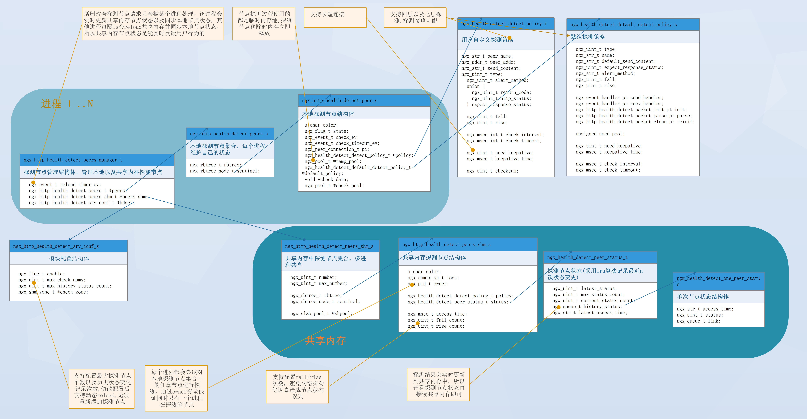

# ngx_health_detect_module

(English language see [here](https://github.com/alexzzh/ngx_health_detect_module/blob/master/README.md))

> 该模块可以提供主动式后端节点健康检查的功能，后端节点可以是Nginx upstream负载节点，在解析upstream配置时自动注册，保证新的请求直接发送到一个健康的后端节点，也可以通过Restful API动态注册后端节点，以便实时查看节点健康状态
-----

- 所有后端节点健康状态  

- 所有状态为DOWN的后端节点  

- 单个后端节点健康状态，历史状态以及探测策略信息


Table of Contents
=================

* [模块开发背景](#模块开发背景)
* [描述](#描述)
* [如何安装](#如何安装)
* [制作patch](#制作patch)
* [开发者快速指南](#开发者快速指南)
* [基本用法](#基本用法)
* [探测策略各字段解释](#探测策略各字段解释)
* [restful api接口说明](#restful-api接口说明)
* [新增nginx指令用法](#新增nginx指令用法)
* [测试报告](#测试报告)
* [未完成的工作](#未完成的工作)
* [项目状态](#项目状态)
* [错误和补丁](#错误和补丁)
* [参考链接](#参考链接)
* [版权和许可](#版权和许可)


模块开发背景
===========
- 项目上需要使用主动健康检查功能而且可能需要结合第三方动态域名解析模块动态增删探测节点，而开源方案 [ngx_healthcheck_module](https://github.com/zhouchangxun/ngx_healthcheck_module/tree/master)不支持动态API且存在一些问题，[ngx_http_upstream_check_module](https://github.com/alibaba/tengine/tree/master/modules/ngx_http_upstream_check_module) 模块虽然支持动态API，但是存在本地以及共享内存节点数组索引使用混乱(1)，重用本地以及共享内存节点空间时节点状态判断条件不严谨(2)，并发访问共享内存节点时锁控制不合理(3)，不支持stream模块等问题
- 考虑到主动健康检查功能比较简单，就是结合upstream模块增删节点以及查询节点状态，其实更适合使用红黑树作为节点存储结构，尤其是探测节点较多时效率更高, 使用红黑树代替动态数组，从根本上上避免了(1),(2)问题的出现，所以代码也更容易理解和维护，由此产生了该模块并修复了上述bug，该模块功能等同于ngx_healthcheck_module/ngx_stream_upstream_check_module模块 + restful api动态增删探测节点功能(开关控制，可关闭)
  - ngx_http_upstream_check_module [bugs](https://github.com/alibaba/tengine/issues/1778) after test in our project
  - ngx_healthcheck_module [bugs](https://github.com/zhouchangxun/ngx_healthcheck_module/issues/57) after test in our project: 


描述
===========
该模块可以提供主动式后端节点健康检查的功能
- 主要特性
  - 后端节点可以是Nginx upstream负载节点，在解析upstream配置时自动注册，保证新的请求直接发送到一个健康的后端节点，也可以通过Restful API动态注册后端节点，以便实时查看节点健康状态
  - 支持四层和七层后端节点的健康检测
    - 四层支持的检测类型：tcp 
    - 七层支持的检测类型：http / https
  - 支持通过restful api`动态`增加/删除后端节点，修改后端节点探测策略以及查询后端节点状态
  - 支持针对后端节点定制探测策略
    - 探测类型
    - 探测间隔以及探测超时时间
    - 发送内容
    - 探测失败告警方式
    - 预期响应值
    - 是否启用长连接以及长连接存活时间
  - 支持同时查询所有后端节点当前状态，输出格式: html / json
  - 支持查询单个后端节点的探测策略以及历史状态，输出格式: html / json

如何安装
============

```
git clone https://github.com/nginx/nginx.git
git clone https://github.com/alexzzh/ngx_health_detect_module.git
cd nginx/;
git checkout branches/stable-x.x.x

//apply patch or adjust nginx code according to the patch file
git apply ../ngx_health_detect_module/patch/nginx_healthdetect_for_nginx_x.xx+.patch

auto/configure --with-stream --add-module=../ngx_health_detect_module
make && make install
```

[Back to TOC](#table-of-contents)

制作patch
============

```
如果patch文件夹下没有对应nginx版本的patch,可以通过下述步骤快速制作:

1 git clone https://github.com/nginx/nginx.git
2 git checkout branches/stable-x.y.z(目标版本)
3 adjust nginx source code according to other version patch, eg : nginx_healthdetect_for_nginx_1.18+.patch
4 diff * > nginx_healthdetect_for_nginx_1.18+.patch
5 upload this patch to this repo if you want
```

[Back to TOC](#table-of-contents)

开发者快速指南
=====

- 类图以及重要成员变量说明


[Back to TOC](#table-of-contents)

基本用法
=======

**nginx.conf 样例** 
```nginx
user  root;
worker_processes  4;
error_log  logs/error.log  info;
#pid        logs/nginx.pid;

events {
    worker_connections  32768;
}

http {
    health_detect_shm_size 10m; #指定用于存放后端节点探测策略以及健康状态的共享内存大小
    health_detect_max_history_status_count 5; #指定单个后端节点历史状态变化的次数

    server {
        listen       641;
        server_name  localhost;
    
       location /http_api { 
           root   html;
           index  index.html index.htm;
           health_detect_dynamic_api check_only=false; #提供http模块的restful API接口
       }

       location /tcp_api {  
           root   html;
           index  index.html index.htm;
           stream_health_detect_dynamic_api check_only=false; #提供stream模块的restful API接口
       }
      	
       location /build-in {
          proxy_pass http://httpbackend;
       }
     }
        
     upstream httpbackend {
          server 1.1.1.1:11111  max_fails=0 fail_timeout=20s;
          # 指定当前upstream启用该模块以及自动注册的节点策略各字段值
          health_detect_check type=http alert_method=syslog rise=2 fall=3 interval=1000 timeout=5000 keepalive=true keepalive_time=500000; 
          # 当探测类型为http时，指定期望后端响应的http响应码
          health_detect_http_expect_alive http_2xx http_3xx;
          # 当探测类型为http时，指定发送的http请求时开启keep-alive，注意当"health_detect_check"指令的keepalive字段为true时使能keep-alive才有意义
          health_detect_http_send "GET / HTTP/1.0\r\nConnection: keep-alive\r\n\r\n";
     }
}

stream {
       health_detect_shm_size 10m; #指定用于存放后端节点探测策略以及健康状态的共享内存大小
       health_detect_max_history_status_count 10; #指定单个后端节点历史状态变化的次数
	
       server {
            listen       642 ;
            proxy_pass  tcpbackend;
         }
      
      upstream tcpbackend {
          server 2.2.2.2:22222  max_fails=0 fail_timeout=20s;
          # 指定当前upstream启用该模块以及自动注册的节点策略各字段值
          health_detect_check type=tcp alert_method=syslog rise=2 fall=3 interval=1000 timeout=5000 keepalive=true keepalive_time=500000; 
      }
} 
```

[Back to TOC](#table-of-contents)

探测策略各字段解释
================
- 无论是在解析upstream配置时自动注册的后端节点还是通过Restful API动态注册后端节点，最终的探测策略包含的字段会保持一致
-----

`语法` 
> {"type":"tcp|http","peer_addr":"ip:port","send_content":"xxx","alert_method":"log|syslog","expect_response_status":"http_2xx|http_3xx|http_4xx|http_5xx","interval":milliseconds,"timeout":milliseconds , "keepalive": "true"|"false", "keepalive_time": milliseconds , "rise":count, "fall":count, "default_down": "true"|"false"}
  
> 只有"type" 和 "peer_addr"是`必选`字段，其他字段不指定时使用默认值

`默认值`: 
- 探测类型为tcp
``` python
 {"send_content":"","alert_method":"log","expect_response_status":"","interval":30000,"timeout":3000 , "keepalive": "false", "keepalive_time": 3600000 , "rise":1, "fall":2, "default_down":"false"}
```
- 探测类型为http
``` python
{"send_content":"GET / HTTP/1.0\r\nConnection:close\r\n\r\n","alert_method":"log","expect_response_status":"http_2xx"，"interval":30000,"timeout":3000 , "keepalive": "true", "keepalive_time": 3600000 , "rise":1, "fall":2, "default_down":"false"}
```

`详细参数`
- type: 探测类型
  - tcp：简单的tcp连接，如果连接成功，就说明后端正常。
  - http：发送HTTP请求，通过后端的回复包的状态来判断后端是否存活。
- peer_addr: 探测节点地址
- send_content： 探测时向后端节点发送内容。
  - tcp: 忽略该字段。
  - http：指定http请求具体内容，如果想启用`http keepalive长连接`，需指定发送内容为"GET / HTTP/1.0\r\nConnection:keep-alive\r\n\r\n\"。
- alert_method： 探测失败时告警方式
  - log：仅仅是记录探测失败日志。
  - syslog: 转发错误日志至syslog。 
- expect_response_status：预期响应值
  - tcp: 忽略该字段。
  - http: 指定收到哪些响应视为后端节点状态正常。
- interval：向后端发送的健康检查包的间隔
- timeout: 后端健康请求的超时时间
- keepalive：指定是否启用长连接，如果使用长连接，多次探测会复用同一个连接，反之每次探测都需要新建连接
  - 长连接比短连接性能更好，但是需要处理连接保活以及持续消耗服务端连接资源问题，不考虑性能的情况下，`推荐`使用短连接。 
  - 探测类型为http且`send_content`指定使用`http keepalive`时，需要设置长连接。
  - 探测类型为tcp且与后端节点连接需要经过防火墙，NAT设备时，`不推荐`使用长连接。因为tcp长连接建立后，探活机制使用的是peek函数，此时即便防火墙会拦截请求包，peek仍然成功，直到超过`keepalive_time`，在此期间探测状态可能有误，设置更短的"keepalive_time" 可以降低该问题带来的影响
- keepalive_time：指定长连接存活时间
- fall(fall_count): 如果连续失败次数达到fall_count，后端节点就被认为是down。
- rise(rise_count): 如果连续成功次数达到rise_count，后端节点就被认为是up。
- default_down : 指定新加入的节点刚开始状态是否为down。

[Back to TOC](#table-of-contents)

restful api接口说明
==================
```
ip:port/http_api/control?cmd=add&name=node_name
ip:port/http_api/control?cmd=delete&name=node_name
ip:port/http_api/control?cmd=delete_all
ip:port/http_api/control?cmd=status&name=node_name[&format=json|html]
ip:port/http_api/control?cmd=status_all[&status=down|up][&format=json|html]
```
- 增加后端节点
``` python
curl -X POST -H 'Content-Type: application/json' -d '{"type":"http","peer_addr":"10.0.229.100:34001","send_content":"GET / HTTP/1.0\r\nConnection:keep-alive\r\n\r\n","alert_method":"log","expect_response":"http_2xx","check_interval":5000,"check_timeout":3000, "need_keepalive": 1, "keepalive_time": 200000, "rise":1, "fall":2}' '10.0.229.99:641/http_api/control?cmd=add\&name=nginx4001'

add or update node success
```
- 删除单个后端节点
``` python
curl -X DELETE '10.0.229.99:641/http_api/control?cmd=delete\&name=nginx4001'

delete node success
```
- 删除所有后端节点
``` python
curl -X DELETE '10.0.229.99:641/http_api/control?cmd=delete_all'

delete all node success
```
- 查询所有后端节点当前状态，输出格式: json
```python
curl http://10.0.229.99:641/http_api/control?cmd=status_all 
{
"total": 151,
 "up": 150,
 "down": 1,
 "max": 6000,
"items": [
    {"name": "nginx81","addr": "10.0.229.100:30081","access_time": 2023/05/06 16:50:04, "status": "up"}, 
    {"name": "nginx66","addr": "10.0.229.100:30066","access_time": 2023/05/06 16:50:04, "status": "up"}, 
    {"name": "nginx85","addr": "10.0.229.100:30085","access_time": 2023/05/06 16:50:04, "status": "up"}, 
    {"name": "nginx62","addr": "10.0.229.100:30062","access_time": 2023/05/06 16:50:04, "status": "up"}, 
    {"name": "nginx37","addr": "10.0.229.100:30037","access_time": 2023/05/06 16:50:04, "status": "up"}, 
    {"name": "nginx107","addr": "10.0.229.100:30107","access_time": 2023/05/06 16:50:01, "status": "down"}, 
    {"name": "nginx103","addr": "10.0.229.100:30103","access_time": 2023/05/06 16:50:01, "status": "down"}, 
...
}
```
- 查询所有后端节点当前状态，输出格式: html
```python
curl http://10.0.229.99:641/http_api/control?cmd=status_all&format=html
```

 
- 查询单个后端节点的探测策略以及历史状态，输出格式: json 

```python
curl http://10.0.229.99:641/http_api/control?cmd=status\&name=nginx100
{"peer_name": "nginx100",
  "type": "http",
  "peer_addr": "10.0.229.100:30100",
  "alert_method": "tcp",
  "expect_response_status": "http_2xx ",
  "check_interval": "5000",
  "check_timeout": "3000",
  "need_keepalive": "1",
  "keepalive_time": "200000",
  "rise": "1",
  "fall": "2",
  "send_content": "GET / HTTP/1.0 Connection:keep-alive    ",
  "access_time": "2023/05/06 16:54:27",
  "latest_status": "up",
  "max_status_count": "5",
  "history_status": {
    "current_status_count": "1",
    "items": [
    {"access_time": 2023/05/06 16:50:01, "status": "up",} 
  ]
}}

```
- 查询单个后端节点的探测策略以及历史状态，输出格式: html 
```python
curl http://10.0.229.99:641/http_api/control?cmd=status\&name=nginx100\&format=html
```


[Back to TOC](#table-of-contents)

新增nginx指令用法
========

health_detect_dynamic_api
-----

`语法`:health_detect_dynamic_api check_only=false|true;

`默认值`: health_detect_dynamic_api check_only=false

`上下文`: http, server, location

指定是否开启动态restful api功能，如果`check_only=false`，表示只支持通过api查询后端节点状态，当后端节点都来源于upstream配置文件时，一般设置为false，反之表示还可以通过api`动态`增加/删除/修改后端节点以及修改节点探测策略


health_detect_shm_size
-----------

`语法`: health_detect_shm_size size;

`默认值`: health_detect_shm_size 10m

`上下文`: http/main, stream/main

指定用于存放后端节点探测策略以及健康状态的共享大小


health_detect_max_history_status_count
-----------

`语法`: health_detect_max_history_status_count count

`默认值`: health_detect_max_history_status_count 5

`上下文`: http/main, stream/main

指定记录单个后端节点历史状态变化的次数，采用lru算法记录最近的count个变化以及对应时间戳


health_detect_check
-----------

`语法`: health_detect_check type=http|tcp [alert_method=log|syslog] [interval=milliseconds] [timeout=milliseconds] [rise=count] [fall=count] [default_down=true|false][keepalive=true|false] [keepalive_time=milliseconds]; 

`默认值`: health_detect_check type=tcp alert_method=log interval=30000 timeout=5000 rise=1 fall=2 default_down=false keepalive=false keepalive_time=3600000;

`上下文`: http/upstream, stream/upstream

通过在http或stream下的upstream配置块中添加该指令来开启对该upstream中的后端节点的健康检查，各字段解释同[探测策略各字段解释](https://github.com/alexzzh/ngx_health_detect_module#%E6%8E%A2%E6%B5%8B%E7%AD%96%E7%95%A5%E5%90%84%E5%AD%97%E6%AE%B5%E8%A7%A3%E9%87%8A)


health_detect_http_expect_alive
-----------

`语法`: health_detect_http_expect_alive http_2xx|http_3xx|http_4xx|http_5xx;

`默认值`: health_detect_http_expect_alive http_2xx|http_3xx

`上下文`: http/upstream, stream/upstream

当探测类型为http时，指定期望后端响应的http响应码


health_detect_http_send
-----------

`语法`: health_detect_http_send xxx;

`默认值`: health_detect_http_send "GET / HTTP/1.0\r\nConnection: close\r\n\r\n";

`上下文`: http/upstream, stream/upstream

当探测类型为http时，指定发送的http请求时内容，比如开启keep-alive， 注意当"health_detect_check"指令的keepalive字段为true时使能keep-alive才有意义


[Back to TOC](#table-of-contents)


测试报告
=========
- 测试环境
```python
cat /proc/cpuinfo 
model name	: Intel(R) Core(TM) i5-6500 CPU @ 3.20GHz

cat /proc/meminfo 
MemTotal:        7924144 kB
MemFree:         3156588 kB
```

| 后端节点数量 | 探测类型 | 长/短连接 | 探测间隔(s) | 进程数 | CPU单核占比 | 内存占比 |
| ------ | ------ | ------ | ------ | ------ | ------ | ------ |
| 8000 | tcp | 长连接 | 1 | 4 | 5% | 0.4% |
| 8000 | http | 长连接 | 1 | 4 | 10% | 0.8% |
| 8000 | tcp | 长连接 | 5 | 4 | 1%-2% | 0.4% |
| 8000 | http | 长连接 | 5 | 4 | 2%-7% | 0.8% |
| 8000 | tcp | 短连接 | 1 | 4 | 10% | 0.4% |
| 8000 | http | 短连接 | 1 | 4 | 20% | 0.8% |
| 8000 | tcp | 短连接 | 5 | 4 | 3%-5% | 0.4% |
| 8000 | http | 短连接 | 5 | 4 | 5% | 0.8% |

[Back to TOC](#table-of-contents)


未完成的工作
=========

- 告警处理
- 功能增强

[Back to TOC](#table-of-contents)

项目状态
======

这个项目还在开发中完善中，欢迎贡献代码，或报告bug。一起使它变得更好。  
有意愿一起开发完善的同学或者有疑问的可以联系我：
- `QQ`:122968309
- `mail`: zzhcore@163.com

[Back to TOC](#table-of-contents)

错误和补丁
================

报告错误

- 点击提交[GitHub Issue](https://github.com/alexzzh/ngx_health_detect_module/issues),

提交你的修复补丁

- 点击提交[Pull request](https://github.com/alexzzh/ngx_health_detect_module/pulls)

[Back to TOC](#table-of-contents)

参考链接
=====================
* ngx_healthcheck_module模块：
    (<https://github.com/zhouchangxun/ngx_healthcheck_module.git>);
* nginx: http://nginx.org

[Back to TOC](#table-of-contents)

版权和许可
=====================
    
This module is licensed under the BSD license.

Copyright (C) 2023, by Alex zhang <zzhcore@163.com>

All rights reserved.

Redistribution and use in source and binary forms, with or without modification, are permitted provided that the following conditions are met:

* Redistributions of source code must retain the above copyright notice, this list of conditions and the following disclaimer.

* Redistributions in binary form must reproduce the above copyright notice, this list of conditions and the following disclaimer in the documentation and/or other materials provided with the distribution.

THIS SOFTWARE IS PROVIDED BY THE COPYRIGHT HOLDERS AND CONTRIBUTORS "AS IS" AND ANY EXPRESS OR IMPLIED WARRANTIES, INCLUDING, BUT NOT LIMITED TO, THE IMPLIED WARRANTIES OF MERCHANTABILITY AND FITNESS FOR A PARTICULAR PURPOSE ARE DISCLAIMED. IN NO EVENT SHALL THE COPYRIGHT HOLDER OR CONTRIBUTORS BE LIABLE FOR ANY DIRECT, INDIRECT, INCIDENTAL, SPECIAL, EXEMPLARY, OR CONSEQUENTIAL DAMAGES (INCLUDING, BUT NOT LIMITED TO, PROCUREMENT OF SUBSTITUTE GOODS OR SERVICES; LOSS OF USE, DATA, OR PROFITS; OR BUSINESS INTERRUPTION) HOWEVER CAUSED AND ON ANY THEORY OF LIABILITY, WHETHER IN CONTRACT, STRICT LIABILITY, OR TORT (INCLUDING NEGLIGENCE OR OTHERWISE) ARISING IN ANY WAY OUT OF THE USE OF THIS SOFTWARE, EVEN IF ADVISED OF THE POSSIBILITY OF SUCH DAMAGE.

[Back to TOC](#table-of-contents)
