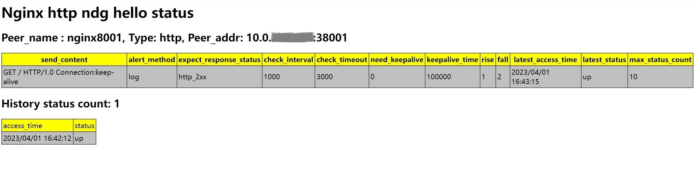

# ngx_http_health_detect_module

(English language see [here]())

> 该模块可以作为通用的后端探测模块，实时探测后端节点健康状态
-----

- 所有后端节点健康状态  

- 单个后端节点健康状态，历史状态以及探测策略信息



Table of Contents
=================

* [描述](#描述)
* [如何安装](#如何安装)
* [基本用法](#基本用法)
* [探测策略各字段解释](#探测策略各字段解释)
* [restful接口说明](#restful接口说明)
* [新增nginx指令用法](#新增nginx指令用法)
* [测试报告](#测试报告)
* [未完成的工作](#未完成的工作)
* [项目状态](#项目状态)
* [错误和补丁](#错误和补丁)
* [参考链接](#参考链接)
* [版权和许可](#版权和许可)


描述
===========
提供通用的后端探测模块，实时探测后端节点健康状态  
- 主要特性
  - 支持四层和七层后端节点的健康检测
    - 四层支持的检测类型：tcp 
    - 七层支持的检测类型：http / https
  - 支持通过restful api`动态`增加/删除后端节点,修改后端节点探测策略以及查询后端节点状态
  - 支持针对后端节点定制探测策略
    - 探测类型
    - 探测间隔以及探测超时时间
    - 发送内容
    - 探测失败告警方式
    - 预期响应值
    - 是否启用长连接以及长连接存活时间
  - 支持同时查询所有后端节点当前状态，输出格式: html / json
  - 支持查询单个后端节点的探测策略以及历史状态，输出格式: html / json

如何安装
============

```
git clone https://github.com/nginx/nginx.git
git clone https://github.com/alexzzh/ngx_http_health_detect_module.git

cd nginx/;
git checkout branches/stable-xxx
./auto/configure --add-module=../ngx_http_health_detect_module/
make && make install
```

[Back to TOC](#table-of-contents)

基本用法
=====

**nginx.conf 样例** 
```nginx
user  root;
worker_processes  4;
error_log  logs/error.log  info;
#pid        logs/nginx.pid;

events {
    worker_connections  32768;
}

http {
    include       mime.types;
    default_type  application/octet-stream;
    server {
        listen       0.0.0.0:9998;
        server_name  localhost;

        health_detect_enable  on;
        health_detect_max_check_nums 10000;
        health_detect_max_history_status_count 10;
        health_detect_check_zone shared:hc:10m;

        location / {
            root   html;
            index  index.html index.htm;
        }
     }
}
```
**探测策略各字段解释**
-----

`语法` 
> {"peer_type":"tcp|http","peer_addr":"ip:port","send_content":"xxx","alert_method":"log|syslog","expect_response_status":"http_2xx|http_3xx|http_4xx|http_5xx","check_interval":1000,"check_timeout":milliseconds , "need_keepalive": 1|0, "keepalive_time": milliseconds , "rise":count, "fall":count}  
  
> 只有"peer_type" 和 "peer_addr"是`必选`字段，其他字段不指定时使用默认值

`默认值`: 
- 探测类型为tcp
> {"send_content":"","alert_method":"log","expect_response_status":"","check_interval":30000,"check_timeout":3000 , "need_keepalive": 0, "keepalive_time": 3600000 , "rise":1, "fall":2}  
- 探测类型为http
> {"send_content":"GET / HTTP/1.0\r\nConnection:close\r\n\r\n","alert_method":"log","expect_response_status":"http_2xx"，"check_interval":30000,"check_timeout":3000 , "need_keepalive": 0, "keepalive_time": 3600000 , "rise":1, "fall":2}

`详细参数`
- peer_type: 探测类型
  - tcp：简单的tcp连接，如果连接成功，就说明后端正常。
  - http：发送HTTP请求，通过后端的回复包的状态来判断后端是否存活。
- peer_addr: 探测节点地址
- send_content： 探测时向后端节点发送内容。
  - tcp: 忽略该字段。
  - http：指定http请求具体内容，如果想启用`http keepalive长连接`，需指定发送内容为"GET / HTTP/1.0\r\nConnection:keep-alive\r\n\r\n\"。
- alert_method： 探测失败时告警方式
  - log：仅仅是记录探测失败日志。
  - syslog: 转发错误日志至syslog。 
- expect_response_status：预期响应值
  - tcp: 忽略该字段。
  - http: 指定收到哪些响应视为后端节点状态正常。
- check_interval：向后端发送的健康检查包的间隔
- check_timeout: 后端健康请求的超时时间
- need_keepalive：指定是否启用长连接，如果使用长连接，多次探测会复用同一个连接，反之每次探测都需要新建连接
  - 长连接比短连接性能更好，但是需要处理连接保活以及持续消耗服务端连接资源问题，不考虑性能的情况下，`推荐`使用短连接。 
  - 探测类型为http且`send_content`指定使用`http keepalive`时，需要设置长连接。
  - 探测类型为tcp且与后端节点连接需要经过防火墙，NAT设备时，`不推荐`使用长连接。因为tcp长连接建立后，探活机制使用的是peek函数，此时即便防火墙会拦截请求包，peek仍然成功，直到超过`keepalive_time`，在此期间探测状态可能有误，设置更短的"keepalive_time" 可以降低该问题带来的影响
- keepalive_time：指定长连接存活时间
- fall(fall_count): 如果连续失败次数达到fall_count，后端节点就被认为是down。
- rise(rise_count): 如果连续成功次数达到rise_count，后端节点就被认为是up。

[Back to TOC](#table-of-contents)

**restful接口说明**
-----
- 增加后端节点
``` python
curl -X POST -i  -H 'Content-Type: application/json'  
  -d "{\"peer_type\":\"http\",\"peer_addr\":\"x.x.x.x:38001\",\"send_content\":\"GET / HTTP/1.0\r\nConnection:keep-alive\r\n\r\n\",\"alert_method\":\"log\",\"expect_response_status\":\"http_2xx\",\"check_interval\":1000,\"check_timeout\":3000, \"need_keepalive\": 1, \"keepalive_time\": 100000, \"rise\":1, \"fall\":2}"  
  server_ip:server_port/add/backend_name
```
- 删除单个后端节点
``` python
curl -X DELETE server_ip:server_port/delete/backend_name
```
- 删除所有后端节点
``` python
curl -X DELETE server_ip:server_port/delete_all
```
- 查询所有后端节点当前状态，输出格式: json
```python
curl http://server_ip:server_port/check_all_status
{
"total": 8000,
 "up": 7900,
 "down": 100,
 "max": 10000,
"items": [
    {"name": "nginx5564","access_time": 2023/04/03 11:10:18, "status": "up"}, 
    {"name": "nginx3158","access_time": 2023/04/03 11:10:18, "status": "up"}, 
    {"name": "nginx7447","access_time": 2023/04/03 11:10:18, "status": "up"}, 
    {"name": "nginx156","access_time": 2023/04/03 11:10:19, "status": "down"},
    ...  
    {"name": "nginx6321","access_time": 2023/04/03 11:10:18, "status": "up"}, 
    {"name": "nginx4857","access_time": 2023/04/03 11:10:19, "status": "up"}, 
    {"name": "nginx5664","access_time": 2023/04/03 11:10:18, "status": "up"},
```
- 查询所有后端节点当前状态，输出格式: html
```python
curl http://server_ip:server_port/check_all_status?format=html
```

 
- 查询单个后端节点的探测策略以及历史状态，输出格式: json 

```python
http://server_ip:server_port/check_status/nginx8001
{"peer_name": "nginx8001",
  "type": "http",
  "peer_addr": "x.x.x.x:38001",
  "send_content": "GET / HTTP/1.0 Connection:keep-alive",
  "alert_method": "log",
  "expect_response_status": "http_2xx ",
  "check_interval": "1000",
  "check_timeout": "3000",
  "need_keepalive": "1",
  "keepalive_time": "100000",
  "rise": "1",
  "fall": "2",
  "access_time": "2023/04/01 16:42:30",
  "latest_status": "up",
  "max_status_count": "10",
  "history_status": {
    "current_status_count": "1",
    "items": [
    {"access_time": 2023/04/01 16:42:12, "status": "up",} 
  ]
}}
```
- 查询单个后端节点的探测策略以及历史状态，输出格式: html 
```python
http://server_ip:server_port/check_status/nginx8001?format=html
```


[Back to TOC](#table-of-contents)

新增nginx指令用法
========

health_detect_enable
-----

`语法`: health_detect_enable on|off

`默认值`: health_detect_enable off

`上下文`: http, server

指定是否开启后端节点健康检查功能。


health_detect_max_check_nums
-----------

`语法`: health_detect_max_check_nums count

`默认值`: health_detect_max_check_nums 20000

`上下文`: http, server

指定最多能探测多少个后端节点


health_detect_max_history_status_count
-----------

`语法`: health_detect_max_history_status_count count

`默认值`: health_detect_max_history_status_count 10

`上下文`: http, server

指定记录单个后端节点历史状态变化的次数，采用lru算法记录最近的count个变化以及对应时间戳


health_detect_check_zone
-----------

`语法`: health_detect_check_zone shared:name:size;

`默认值`: health_detect_check_zone shared:hc:10m

`上下文`: http, server

指定用于存放后端节点探测策略以及健康状态的共享内存名称以及大小


[Back to TOC](#table-of-contents)


测试报告
=========
- 测试环境
```python
cat /proc/cpuinfo 
model name	: Intel(R) Core(TM) i5-6500 CPU @ 3.20GHz

cat /proc/meminfo 
MemTotal:        7924144 kB
MemFree:         3156588 kB
```

| 后端节点数量 | 探测类型 | 长/短连接 | 探测间隔(s) | 进程数 | CPU单核占比 | 内存占比 |
| ------ | ------ | ------ | ------ | ------ | ------ | ------ |
| 8000 | tcp | 长连接 | 1 | 4 | 5% | 0.4% |
| 8000 | http | 长连接 | 1 | 4 | 10% | 0.8% |
| 8000 | tcp | 长连接 | 5 | 4 | 1%-2% | 0.4% |
| 8000 | http | 长连接 | 5 | 4 | 2%-7% | 0.8% |
| 8000 | tcp | 短连接 | 1 | 4 | 10% | 0.4% |
| 8000 | http | 短连接 | 1 | 4 | 20% | 0.8% |
| 8000 | tcp | 短连接 | 5 | 4 | 3%-5% | 0.4% |
| 8000 | http | 短连接 | 5 | 4 | 5% | 0.8% |

[Back to TOC](#table-of-contents)

未完成的工作
=========

- 功能增强

[Back to TOC](#table-of-contents)

项目状态
======

这个项目还在开发中完善中，欢迎贡献代码，或报告bug。一起使它变得更好。  
有意愿一起开发完善的同学或者有疑问的可以联系我：
- `QQ`:122968309
- `mail`: zzhcore@163.com

[Back to TOC](#table-of-contents)

错误和补丁
================

报告错误

- 点击提交[GitHub Issue](https://github.com/alexzzh/ngx_http_health_detect_module/issues),

提交你的修复补丁

- 点击提交[Pull request](https://github.com/alexzzh/ngx_http_health_detect_module/pulls)

[Back to TOC](#table-of-contents)

参考链接
=====================
* ngx_healthcheck_module模块：
    (<https://github.com/zhouchangxun/ngx_healthcheck_module.git>);
* nginx: http://nginx.org

[Back to TOC](#table-of-contents)

版权和许可
=====================
    
This module is licensed under the BSD license.

Copyright (C) 2023, by Alex zhang <zzhcore@163.com>

All rights reserved.

Redistribution and use in source and binary forms, with or without modification, are permitted provided that the following conditions are met:

* Redistributions of source code must retain the above copyright notice, this list of conditions and the following disclaimer.

* Redistributions in binary form must reproduce the above copyright notice, this list of conditions and the following disclaimer in the documentation and/or other materials provided with the distribution.

THIS SOFTWARE IS PROVIDED BY THE COPYRIGHT HOLDERS AND CONTRIBUTORS "AS IS" AND ANY EXPRESS OR IMPLIED WARRANTIES, INCLUDING, BUT NOT LIMITED TO, THE IMPLIED WARRANTIES OF MERCHANTABILITY AND FITNESS FOR A PARTICULAR PURPOSE ARE DISCLAIMED. IN NO EVENT SHALL THE COPYRIGHT HOLDER OR CONTRIBUTORS BE LIABLE FOR ANY DIRECT, INDIRECT, INCIDENTAL, SPECIAL, EXEMPLARY, OR CONSEQUENTIAL DAMAGES (INCLUDING, BUT NOT LIMITED TO, PROCUREMENT OF SUBSTITUTE GOODS OR SERVICES; LOSS OF USE, DATA, OR PROFITS; OR BUSINESS INTERRUPTION) HOWEVER CAUSED AND ON ANY THEORY OF LIABILITY, WHETHER IN CONTRACT, STRICT LIABILITY, OR TORT (INCLUDING NEGLIGENCE OR OTHERWISE) ARISING IN ANY WAY OUT OF THE USE OF THIS SOFTWARE, EVEN IF ADVISED OF THE POSSIBILITY OF SUCH DAMAGE.

[Back to TOC](#table-of-contents)
