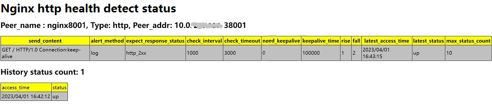

# ngx_http_health_detect_module

(中文版本请参考这里 [here](http://git.koal.com/zhangzhenghao/ngx_http_health_detect_module/-/blob/master/README-zh.md))

> This module can be used as a general health check module to detect the health status of backend nodes in real time
-----

-  All backend node health status

- One backend node health status, historical status, and detect policy



Table of Contents
=================

* [Description](#Description)
* [How to install](#How to install)
* [Quick Guide for Developers](#Quick Guide for Developers)
* [Basic usage](#Basic usage)
* [Detect policy description](#Detect policy description)
* [Restful api](#Restful api)
* [Added nginx directive](#Added nginx directive)
* [Test report](#Test Report)
* [Todo](#Todo)
* [Status](#Status)
* [Bugs and patches](#Bugs and patches)
* [See also](#See also)
* [Copyright and License](#Copyright and License)


Description
===========

Provides a general health check module to detect the health status of backend nodes in real time 
- Main features
  - Supports health detection of Layer 4 and Layer 7 backend nodes
    - Four-layer supported detection type: TCP 
    - Seven-layer supported detection type: http / https
  - Support 'dynamically' adding/removing backend nodes, modifying backend node detection policies, and checking backend node status through Restful API
  - Support customized detect policies for backend nodes
    - Detect type
    - Detect interval and Detect timeout
    - Send content
    - Detection failure alarm mode
    - Expected response value
    - Long/Short connection and how long connection live
  - Support checking the current status of all backend nodes at the same time, output format: html / json
  - Support checking the detection policy and historical status of a one backend node, output format: html / json
  
How to install
============

```
git clone https://github.com/nginx/nginx.git
git clone http://git.koal.com/zhangzhenghao/ngx_http_health_detect_module
cd nginx/;
git checkout branches/stable-xxx
./auto/configure --add-module=../ngx_http_health_detect_module/
make && make install
```

[Back to TOC](#table-of-contents)

Quick Guide for Developers
==========================

- Class diagrams and descriptions of important member variables


[Back to TOC](#table-of-contents)

Basic usage
===========

**nginx.conf** 
```nginx
user  root;
worker_processes  4;
error_log  logs/error.log  info;
#pid        logs/nginx.pid;

events {
    worker_connections  32768;
}

http {
    include       mime.types;
    default_type  application/octet-stream;
    server {
        listen       0.0.0.0:9998;
        server_name  localhost;

        health_detect_enable  on;
        health_detect_max_check_nums 10000;
        health_detect_max_history_status_count 10;
        health_detect_check_zone shared:hc:10m;

        location / {
            root   html;
            index  index.html index.htm;
        }
     }
}
```
Detect policy description
==========================

`Syntax` 
> {"peer_type":"tcp|http","peer_addr":"ip:port","send_content":"xxx","alert_method":"log|syslog","expect_response_status":"http_2xx|http_3xx|http_4xx|http_5xx","check_interval":1000,"check_timeout":milliseconds , "need_keepalive": 1|0, "keepalive_time": milliseconds , "rise":count, "fall":count}  
  
> Only `peer_type` and `peer_addr` fields are `must` required, other fields use default value if not specified

`Default`: 
- tcp
``` python
 {"send_content":"","alert_method":"log","expect_response_status":"","check_interval":30000,"check_timeout":3000 , "need_keepalive": 0, "keepalive_time": 3600000 , "rise":1, "fall":2}  
```
- http
``` python
{"send_content":"GET / HTTP/1.0\r\nConnection:close\r\n\r\n","alert_method":"log","expect_response_status":"http_2xx"，"check_interval":30000,"check_timeout":3000 , "need_keepalive": 0, "keepalive_time": 3600000 , "rise":1, "fall":2}
```

`Detail`
- peer_type: detect type
  - tcp：simple tcp connection, if the connection is successful, it shows the back-end normal.
  - http：send an HTTP request, by the state of the back-end reply packet to determine whether the back-end survival.
- peer_addr: detect node address
- send_content：send content to backend nodes when detecing.
  - tcp: ignore
  - http：specify the content of the http request, if you want to enable 'http keepalive', specify the sending content as "GET / HTTP/1.0\r\nConnection:keep-alive\r\n\r\n".
- alert_method： alert method when detection fails
  - log: just log the detect failure.
  - syslog: forwards error logs to syslog.
- expect_response_status： the expected response value
  - tcp: ignore
  - http: specifies which responses are received to be considered healthy for the backend node.
- check_interval：the interval of health check packets sent to the backend
- check_timeout: timeout for backend health requests
- need_keepalive： specifies whether long connections are enabled, if long connections are used, multiple detection will multiplex the same connection, otherwise each detect requires a new connection
  - long connections have better performance than short connections, but they need to deal with connection keepalive and continuous consumption of server-side connection resources, and short connections are 'recommended' regardless of performance.  
  - if the detect type is HTTP and 'send_content' specifies the use of 'HTTP keepalive', long connection needs to be set.
  - long connections are 'not recommended' when the detect type is tcp and the connection to the backend node needs to go through a firewall, NAT device. Because after the TCP long connection is established, the detection mechanism uses the peek function, at this time, even if the firewall drop the request packet, peek function still succeed until the 'keepalive_time' is exceeded, during which the detect status may be incorrect, and setting a shorter "keepalive_time" can reduce the impact of this problem
- keepalive_time：specifies the long connection time-to-live
- fall(fall_count): the server is considered down if the number of consecutive failures reaches fall_count.
- rise(rise_count): the server is considered up if the number of consecutive successes reaches rise_count.

[Back to TOC](#table-of-contents)

Restful api
==========================

- Add detect node
``` python
curl -X POST -i  -H 'Content-Type: application/json'  
  -d "{\"peer_type\":\"http\",\"peer_addr\":\"x.x.x.x:38001\",\"send_content\":\"GET / HTTP/1.0\r\nConnection:keep-alive\r\n\r\n\",\"alert_method\":\"log\",\"expect_response_status\":\"http_2xx\",\"check_interval\":1000,\"check_timeout\":3000, \"need_keepalive\": 1, \"keepalive_time\": 100000, \"rise\":1, \"fall\":2}"  
  server_ip:server_port/add/backend_name
```
- Delete one detect node
``` python
curl -X DELETE server_ip:server_port/delete/backend_name
```
- Delete all detect node 
``` python
curl -X DELETE server_ip:server_port/delete_all
```
- Check current status of all detect nodes，format: json
```python
curl http://server_ip:server_port/check_all_status
{
"total": 8000,
 "up": 7900,
 "down": 100,
 "max": 10000,
"items": [
    {"name": "nginx5564","access_time": 2023/04/03 11:10:18, "status": "up"}, 
    {"name": "nginx3158","access_time": 2023/04/03 11:10:18, "status": "up"}, 
    {"name": "nginx7447","access_time": 2023/04/03 11:10:18, "status": "up"}, 
    {"name": "nginx156","access_time": 2023/04/03 11:10:19, "status": "down"},
    ...  
    {"name": "nginx6321","access_time": 2023/04/03 11:10:18, "status": "up"}, 
    {"name": "nginx4857","access_time": 2023/04/03 11:10:19, "status": "up"}, 
    {"name": "nginx5664","access_time": 2023/04/03 11:10:18, "status": "up"},
```
- Check current status of all detect nodes，format: html
```python
curl http://server_ip:server_port/check_all_status?format=html
```

 
- Check one detect node policy and history status, format: json 

```python
http://server_ip:server_port/check_status/nginx8001
{"peer_name": "nginx8001",
  "type": "http",
  "peer_addr": "x.x.x.x:38001",
  "send_content": "GET / HTTP/1.0 Connection:keep-alive",
  "alert_method": "log",
  "expect_response_status": "http_2xx ",
  "check_interval": "1000",
  "check_timeout": "3000",
  "need_keepalive": "1",
  "keepalive_time": "100000",
  "rise": "1",
  "fall": "2",
  "access_time": "2023/04/01 16:42:30",
  "latest_status": "up",
  "max_status_count": "10",
  "history_status": {
    "current_status_count": "1",
    "items": [
    {"access_time": 2023/04/01 16:42:12, "status": "up",} 
  ]
}}
```
- Check one detect node policy and history status, format: html
```python
http://server_ip:server_port/check_status/nginx8001?format=html
```


[Back to TOC](#table-of-contents)

Added nginx directive
========

health_detect_enable
-----

`Syntax`: health_detect_enable on|off

`Default`: health_detect_enable off

`Context`: http, server

Specifies whether to enable ths health detect module.


health_detect_max_check_nums
-----------

`Syntax`: health_detect_max_check_nums count

`Default`: health_detect_max_check_nums 20000

`Context`: http, server

Specifies the maximum number of backend nodes that can be detected.


health_detect_max_history_status_count
-----------

`Syntax`: health_detect_max_history_status_count count

`Default`: health_detect_max_history_status_count 10

`Context`: http, server

Specify the number of times the historical status of a one backend node is recorded, and use the lru algorithm to record the latest count changes and the corresponding timestamp


health_detect_check_zone
-----------

`Syntax`: health_detect_check_zone shared:name:size;

`Default`: health_detect_check_zone shared:hc:10m

`Context`: http, server

Specify the name and size of the shared memory used to hold the backend node delect policy and health status


[Back to TOC](#table-of-contents)


Test report
=========

- Test env
```python
cat /proc/cpuinfo 
model name	: Intel(R) Core(TM) i5-6500 CPU @ 3.20GHz

cat /proc/meminfo 
MemTotal:        7924144 kB
MemFree:         3156588 kB
```

| nodes nums | detect type | Long/short connection | detect interval(s) | process | cpu | mem |
| ------ | ------ | ------ | ------ | ------ | ------ | ------ |
| 8000 | tcp | long | 1 | 4 | 5% | 0.4% |
| 8000 | http | long | 1 | 4 | 10% | 0.8% |
| 8000 | tcp | long | 5 | 4 | 1%-2% | 0.4% |
| 8000 | http | long | 5 | 4 | 2%-7% | 0.8% |
| 8000 | tcp | short | 1 | 4 | 10% | 0.4% |
| 8000 | http | short | 1 | 4 | 20% | 0.8% |
| 8000 | tcp | short | 5 | 4 | 3%-5% | 0.4% |
| 8000 | http | short | 5 | 4 | 5% | 0.8% |

[Back to TOC](#table-of-contents)

Todo
=========

- Bug fix
- Feature enhance.

[Back to TOC](#table-of-contents)

Status
======

This nginx module is still under development，you are welcome to contribute code, or report bugs. Together to make it better.

If you have any questions, please contact me:
- `QQ`:122968309
- `mail`: zzhcore@163.com

[Back to TOC](#table-of-contents)

Bugs and Patches
================

Please report bugs

- create[GitHub Issue](http://git.koal.com/zhangzhenghao/ngx_http_health_detect_module/-/issues),

or submit patches by

- new [Pull request](http://git.koal.com/zhangzhenghao/ngx_http_health_detect_module/-/merge_requests)

[Back to TOC](#table-of-contents)

See also
========
* ngx_healthcheck_module：
    (<https://github.com/zhouchangxun/ngx_healthcheck_module.git>);
* nginx: http://nginx.org

[Back to TOC](#table-of-contents)

Copyright and License
=====================
    
This module is licensed under the BSD license.

Copyright (C) 2023, by Alex zhang <zzhcore@163.com>

All rights reserved.

Redistribution and use in source and binary forms, with or without modification, are permitted provided that the following conditions are met:

* Redistributions of source code must retain the above copyright notice, this list of conditions and the following disclaimer.

* Redistributions in binary form must reproduce the above copyright notice, this list of conditions and the following disclaimer in the documentation and/or other materials provided with the distribution.

THIS SOFTWARE IS PROVIDED BY THE COPYRIGHT HOLDERS AND CONTRIBUTORS "AS IS" AND ANY EXPRESS OR IMPLIED WARRANTIES, INCLUDING, BUT NOT LIMITED TO, THE IMPLIED WARRANTIES OF MERCHANTABILITY AND FITNESS FOR A PARTICULAR PURPOSE ARE DISCLAIMED. IN NO EVENT SHALL THE COPYRIGHT HOLDER OR CONTRIBUTORS BE LIABLE FOR ANY DIRECT, INDIRECT, INCIDENTAL, SPECIAL, EXEMPLARY, OR CONSEQUENTIAL DAMAGES (INCLUDING, BUT NOT LIMITED TO, PROCUREMENT OF SUBSTITUTE GOODS OR SERVICES; LOSS OF USE, DATA, OR PROFITS; OR BUSINESS INTERRUPTION) HOWEVER CAUSED AND ON ANY THEORY OF LIABILITY, WHETHER IN CONTRACT, STRICT LIABILITY, OR TORT (INCLUDING NEGLIGENCE OR OTHERWISE) ARISING IN ANY WAY OUT OF THE USE OF THIS SOFTWARE, EVEN IF ADVISED OF THE POSSIBILITY OF SUCH DAMAGE.

[Back to TOC](#table-of-contents)
